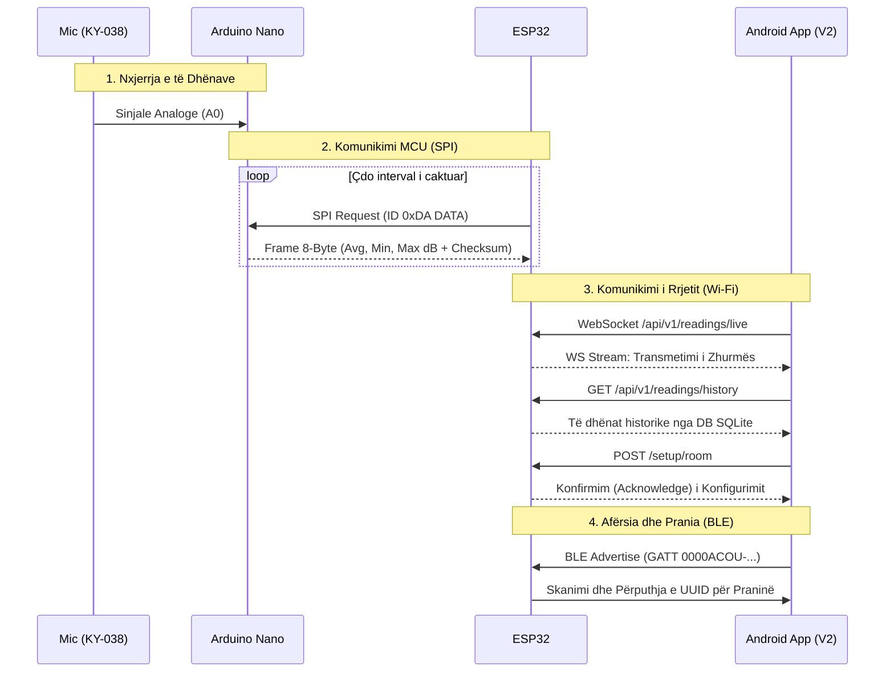

# Protokollet e Komunikimit dhe Fluksi (Communication Protocols)

Ky diagram sekuencial tregon se si kalojnë të dhënat nga mikrofoni (hardueri) tek sensori Nano, më pas tek serveri Gateway (ESP32) dhe në fund në aplikacionin e përdoruesit (DSP-App V2).

