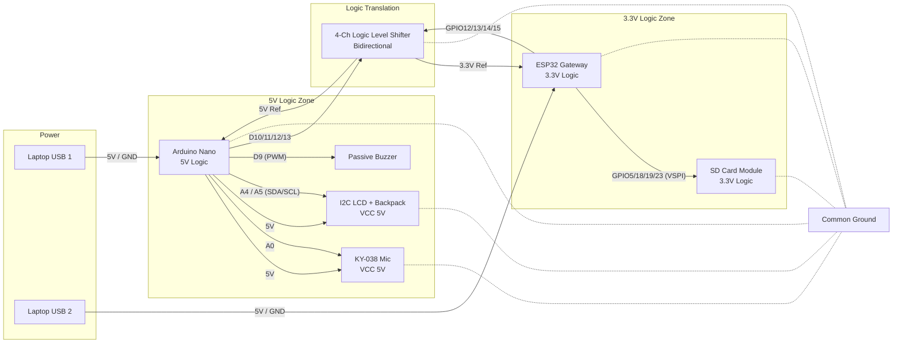

# Lidhjet Harduerike dhe Nivelet e Logjikës (Hardware Wiring & Logic Levels)

Diagram që përshkruan arkitekturën inxhinierike, posaçërisht sfidat e furnizimit me energji dhe përkthimit të nivelit të tensionit (Voltage Level Translation) gjatë komunikimit SPI.

