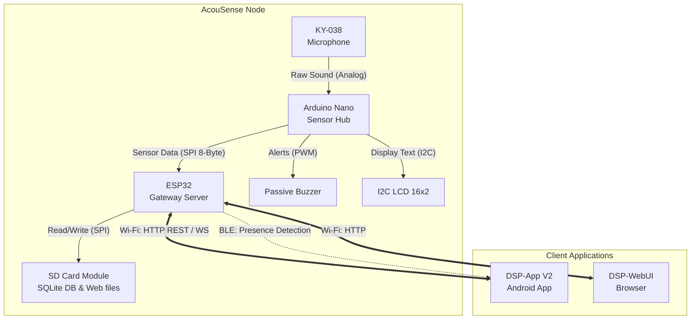

# Arkitektura e Përgjithshme e Sistemit (System Architecture)

Ky diagram tregon pamjen nga lart të gjithë ekosistemit AcouSense, ku tregohet se si komponentët kryesorë (nyja e sensorit dhe aplikacionet e klientit) ndërveprojnë me njëri-tjetrin.

